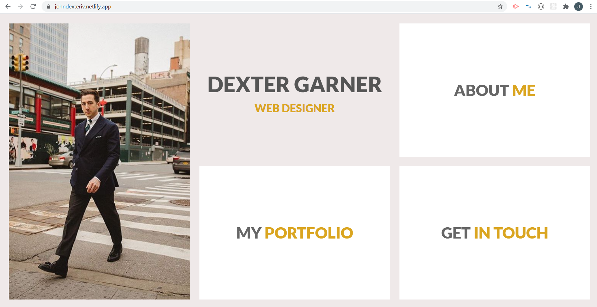
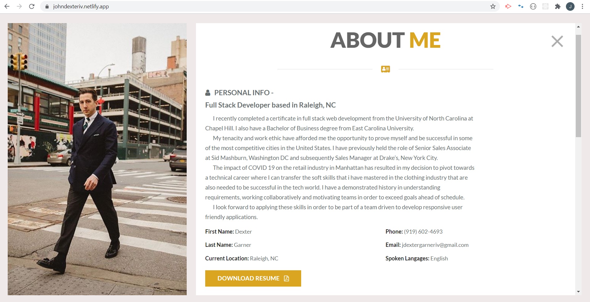
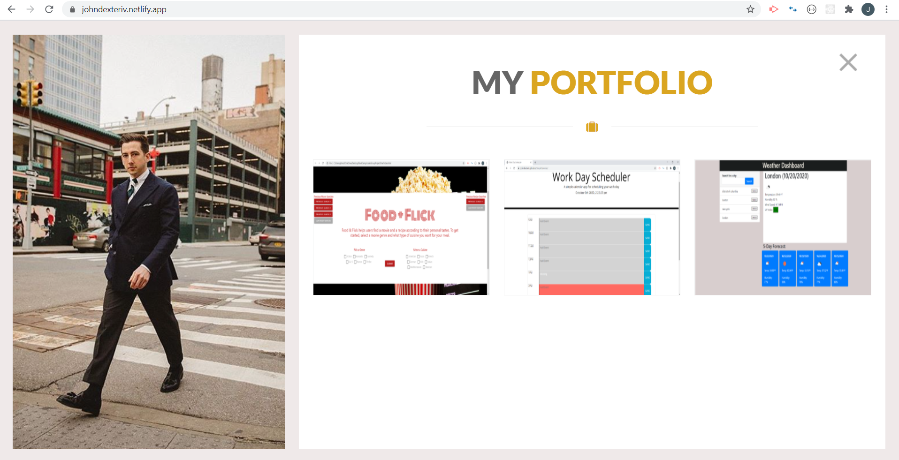
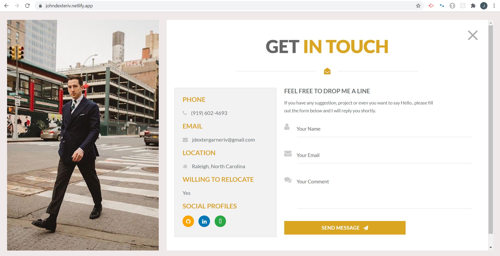

# jdGPortfolio

### Updated portfolio - Project

Clean mobile responsive and interactive portfolio without having too many bells and whistles.

Deployed on netlify in order to optimize the contact form function without using a server to interact with PHP.

Utilizes the following technologies:

1. HTML5
2. CSS
3. Materialize
4. Font Awesome
5. JavaScript
6. JQuery
7. PHP to submit contact form (Optional with local web server)
8. Netlify

Project Requirements

1. Display full name, email and phone number
2. Have links to your GitHub profile and LinkedIn Profile
3. Have a link to a downloadable PDF of your resume
4. Display at least two examples of student work from either deployed projects
or homeworks. For each project, make sure to have the following:
    - Project title
    - Link to the deployed version
    - Link to GitHub repo
    - Screenshot of the deployed application
5. Have a polished, mobile-responsive user interface.

https://johndexteriv.netlify.app/   https://github.com/johndexteriv/jdGPortfolio

